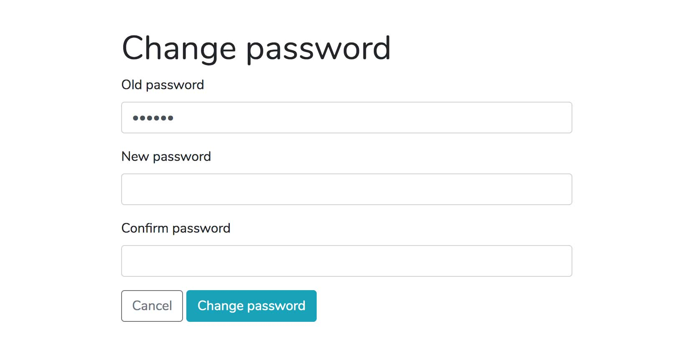

# Frontend development task

Build the form illustrated below using [Bootstcrap 4](https://getbootstrap.com/) and add validation with [React](https://reactjs.org/). Please follow all the instructions.

## Guidelines and standards
Requirements:
* Please follow [W3C](https://www.w3.org/TR/WCAG21/) guidelines (you can validate your code here http://validator.w3.org/)
* Make best use of HTML5 and ARIA semantics to ensure the form is accessible (https://webaim.org/techniques/forms/)
* Use progressive enhancement (https://www.gov.uk/service-manual/technology/using-progressive-enhancement)



### 1. Fork the repository into your Github account and clone the new repository
```bash
git clone https://github.com/.../frontend-task.git
```

### 2. Create a feature branch
Create a feature branch and name it with your first name and last name
```bash
git branch feature/firstname-lastname
git checkout feature/firstname-lastname
```

### 3. Build your form
#### Development setup
Use [Bootstcrap 4](https://getbootstrap.com/) and React for validation. Please install the frameworks via [npm](https://www.npmjs.com/).
#### Form build
Build your form with validation and error messages. Ensure the form is responsive, mobile first approach. Add validation rules to the following fields:
* Old password -> required
* New password -> required, min of 8 characters and a mixture of numbers and letters 

### 4. Write an unit test
Write one test of your choice for a validation rule you created.

### 5. Create a Pull Request
Once finished, add/commit your work and push your branch to Github, create a Pull Request and assign me ([domingobishop](https://github.com/domingobishop)) as the Reviewer.
