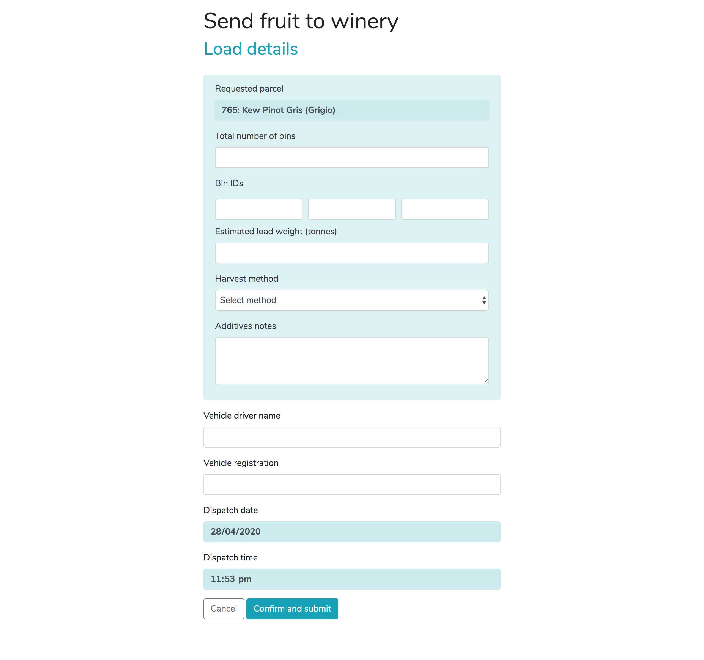

# Frontend development task

Build the form below using [Bootscrap 4](https://getbootstrap.com/) and add validation with a JavaScript framework. 

## Guidelines and standards
Please ensure to follow W3C standards:
* [W3C](https://www.w3.org/TR/WCAG21/) guidelines (you can validate your code here http://validator.w3.org/)
* Make best use of HTML5 and ARIA semantics to ensure the form is accessible (https://webaim.org/techniques/forms/)



### 1. Clone this repository
```bash
git clone https://github.com/GT-Technology/frontend-task.git
```

### 2. Create a feature branch
Create a feature branch and name it with your first name and last name
```bash
git branch feature/firstname-lastname
git checkout feature/firstname-lastname
```

### 3. Build your form
Build your form using [Bootscrap 4](https://getbootstrap.com/) with validation and error messages. Add validation to the following fields:
* Total number of bins -> required and as integer to the whole number
* Estimated load weight -> required and as integer to second decimal place
* Vehicle registration -> required with a max of 12 characters 

#### **NOTE: Please use [atomic commits](https://seesparkbox.com/foundry/atomic_commits_with_git)**

### 4. Add extra Bin ID fields
Use JavaScript to dynamically add extra Bin ID fields via a button.

### 5. Create a Pull Request
Once finished, add/commit your work and push your branch to Github, create a Pull Request and assign me ([https://github.com/domingobishop](domingobishop)) as the Reviewer.
